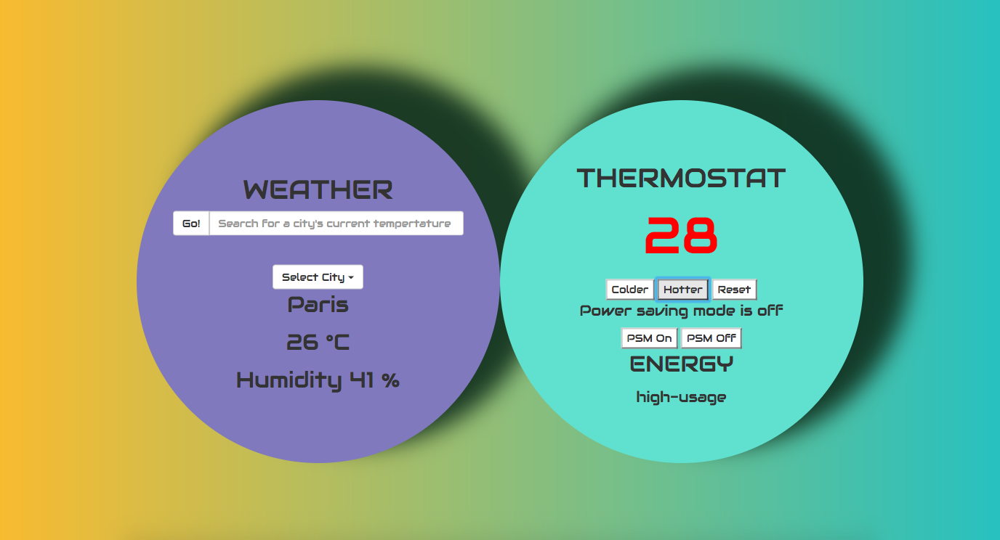

## Thermostat

Used Jasmine to Test-Drive Development of a thermostat.

### Instructions:

run  `open views/index.html`

run ` open SpecRunner.html`

### Specification:

- Thermostat starts at 20 degrees
- You can increase the temperature with an up function
- You can decrease the temperature with a down function
- The minimum temperature is 10 degrees
- If power saving mode is on, the maximum temperature is 25 degrees
- If power saving mode is off, the maximum temperature is 32 degrees
- Power saving mode is on by default
- You can reset the temperature to 20 with a reset function
- You can ask about the thermostat's current energy usage: < 18 is low-usage, < 25 is medium-usage, anything else is high-usage.
- Used a jQuery AJAX call to get the weather information from a weather API.
- Display the weather information to the user.
- User can select their current city (type or select from the dropdown menu) and the weather provided is for the selected city.
